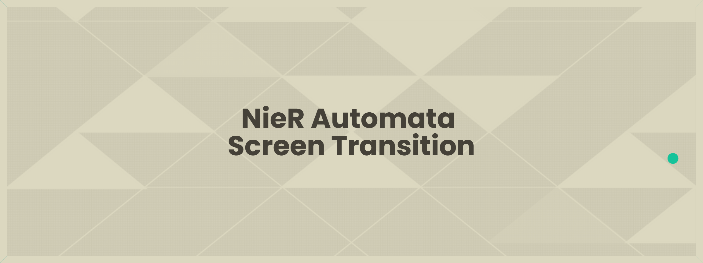
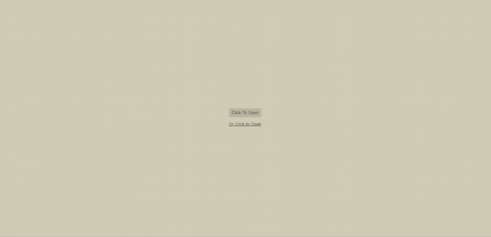

# NieR Automata Screen Transition

NieR Automata Screen Transition in CSS and JS. As far as I know, the only missing piece (together with the game start loading screen) in the many CSS/JS recreations of NieR Automata aesthetics.

### Disclaimer
This is a saturday night hobby project by a fool that hasn't dealt in professional web development for a year or so. The code is really brutal and unoptimised. Anybody has the right to take this mess as general inspiration and do NieR Automata screen transition justice with a proper job.

## Preview

 

## Dependencies
This screen transition is mostly based on [AnimeJS](https://github.com/juliangarnier/anime). 
Of course, nothing bets [metakirby5](https://github.com/metakirby5) amazing [Yorha-CSS](https://github.com/metakirby5/yorha) template for any NieR Automata aesthetics need.
A parsimonial amount of [jQuery](https://github.com/jquery/jquery) has also been used, but it would be rather easy for anybody to get rid of it if need be.

  

